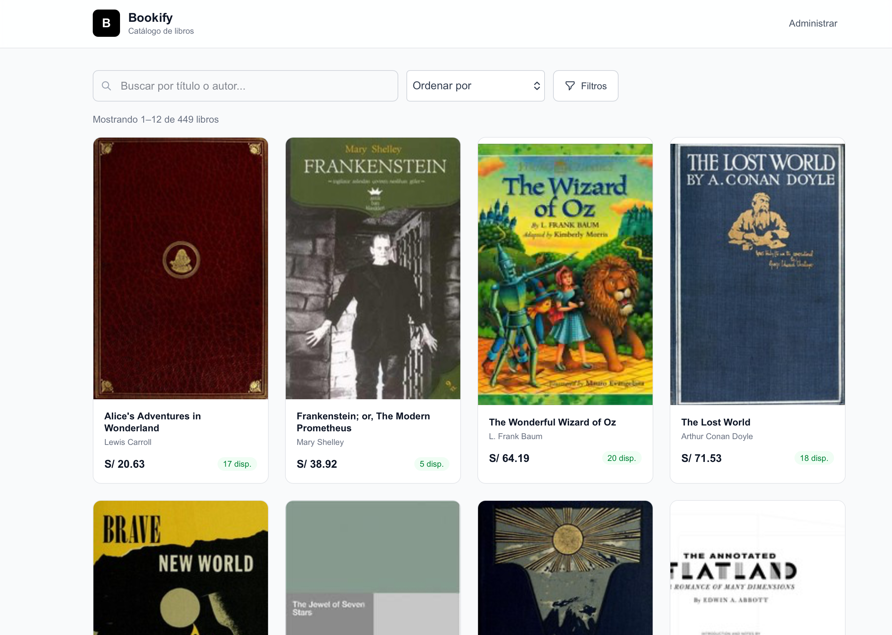
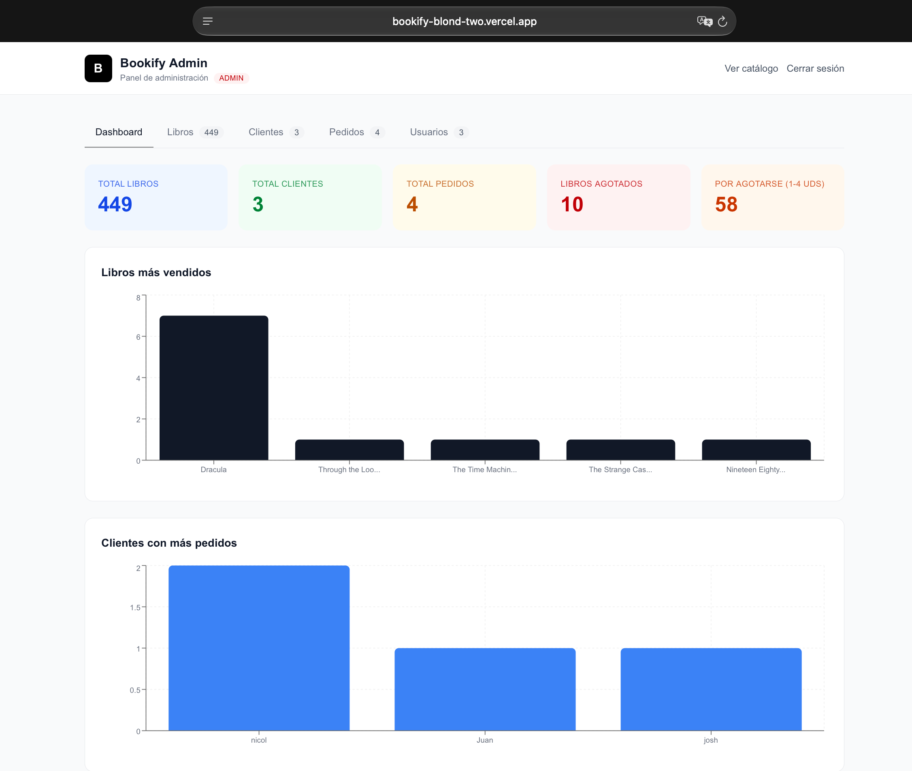
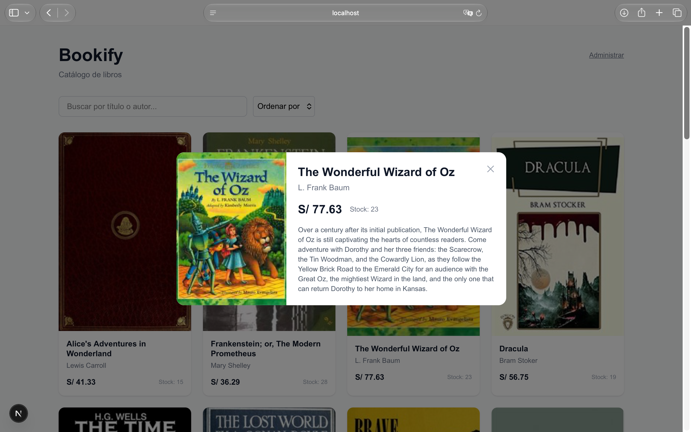
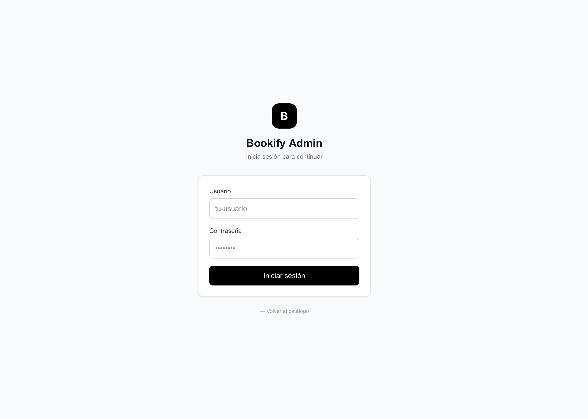

# 📚 Bookify

**Sistema de gestión de biblioteca full-stack con autenticación, panel de administración propio y API REST.**

Bookify nació de una idea simple: construir un sistema completo donde los usuarios puedan ver un catálogo de libros y un administrador pueda gestionarlos desde una interfaz moderna. No es un proyecto para producción, es una demostración de que puedo construir una aplicación full-stack funcional, desde la base de datos hasta el despliegue en contenedores.

---

## 📸 Capturas

| Catálogo público | Panel de administración |
|:---:|:---:|
|  |  |

| Modal de detalles | Login |
|:---:|:---:|
|  |  |

---

## ✨ Características

- **Catálogo público:** lista de libros con portada, precio y stock. Los datos se pueblan automáticamente desde la API de Open Library.
- **Búsqueda y ordenamiento:** por título, autor, precio o fecha.
- **Modal de detalles:** muestra la descripción real del libro obtenida en vivo desde Open Library.
- **Panel de administración propio:** construido en React, no el admin de Django. Permite CRUD completo de libros desde una interfaz moderna.
- **Autenticación por sesión:** protege las rutas de administración tanto en frontend como en backend.
- **Containerización total:** toda la aplicación (base de datos, backend y frontend) se levanta con un solo comando.
- **Inicialización automática:** al arrancar, Docker ejecuta migraciones, crea el usuario admin y puebla la base de datos con libros reales.

---

## 🛠️ Stack

**Backend**
- Python 3.14 · Django · Django REST Framework
- PostgreSQL 16 · django-cors-headers

**Frontend**
- Next.js 16 (App Router) · TypeScript · React 19 · Tailwind CSS 4

**Infraestructura**
- Docker · Docker Compose

---

## 🚀 Cómo levantar el proyecto

### Requisitos

- Docker y Docker Compose instalados
- Puertos 3000 (frontend) y 8000 (backend) libres

### Pasos

Abre tu terminal y ejecuta:

```bash
git clone https://github.com/JoshuaTerrones/bookify.git
cd bookify
docker-compose up --build
```

Eso es todo. Docker se encarga de:

1. Levantar PostgreSQL
2. Aplicar migraciones
3. Crear el superusuario por defecto
4. Poblar la base de datos con libros desde Open Library
5. Iniciar el backend y el frontend

La primera vez puede tardar un poco porque descarga imágenes y dependencias. Las siguientes veces es casi instantáneo.

---

## 🌐 Cómo acceder

| Qué | URL | Notas |
|:---|:---|:---|
| Catálogo público | http://localhost:3000 | Página principal, sin login |
| Panel de administración | http://localhost:3000/admin | Requiere login |
| Login | http://localhost:3000/login | Usuario: `root` — Contraseña: `root` |
| API REST | http://localhost:8000/api/libros/ | Devuelve JSON directo |
| Admin nativo de Django | http://localhost:8000/admin/ | Panel genérico de Django, mismo usuario |

**Para detener todo:**

```bash
docker-compose down
```

---

## 🗺️ Rutas de la API

Todas las rutas están bajo el prefijo `/api/`. La autenticación se maneja con sesiones de Django.

| Método | Ruta | Descripción | Permisos |
|:---|:---|:---|:---|
| `GET` | `/api/libros/` | Lista todos los libros | Público |
| `POST` | `/api/libros/` | Crea un nuevo libro | Autenticado |
| `GET` | `/api/libros/{id}/` | Obtiene un libro por ID | Público |
| `PUT` | `/api/libros/{id}/` | Actualiza un libro completo | Autenticado |
| `PATCH` | `/api/libros/{id}/` | Actualiza parcialmente un libro | Autenticado |
| `DELETE` | `/api/libros/{id}/` | Elimina un libro | Autenticado |
| `GET` | `/api/clientes/` | Lista todos los clientes | Autenticado |
| `POST` | `/api/clientes/` | Crea un nuevo cliente | Autenticado |
| `POST` | `/api/login/` | Inicia sesión. Devuelve `{ok: true}` o 401 | Público |
| `POST` | `/api/logout/` | Cierra la sesión actual | Autenticado |
| `GET` | `/api/me/` | Devuelve `{autenticado: true, username: ...}` | Público |

**Nota:** los endpoints de `libros` y `clientes` usan `ModelViewSet` de DRF, que genera el CRUD completo. Los permisos se manejan en el método `get_permissions` del `LibroViewSet`.

---

## 🖥️ Rutas del Frontend

El frontend usa el App Router de Next.js.

| Ruta | Página | Descripción |
|:---|:---|:---|
| `/` | `app/page.tsx` | Catálogo público. No requiere login. |
| `/login` | `app/login/page.tsx` | Inicio de sesión. |
| `/admin` | `app/admin/page.tsx` | Panel de administración. Redirige a `/login` si no hay sesión. |

---

## 🐳 Docker: el proceso completo

Esta fue la parte que más me costó. No solo era levantar los contenedores, sino hacer que al arrancar se ejecutaran todos los comandos necesarios **en el orden correcto** y que el frontend abriera las páginas que debía. Documentarlo aquí es parte del aprendizaje.

### docker-compose.yml

Define tres servicios: `db`, `web` y `frontend`.

**db:** PostgreSQL 16. Incluye un `healthcheck` para asegurar que la base de datos esté lista antes de que el backend se conecte.

**web:** el backend. El comando de arranque encadena cuatro pasos:

```
python manage.py migrate &&
python manage.py crear_admin &&
python manage.py poblar_libros &&
python manage.py runserver 0.0.0.0:8000
```

1. `migrate` — aplica las migraciones.
2. `crear_admin` — crea el superusuario `root` si no existe (comando custom).
3. `poblar_libros` — puebla la base de datos con libros desde Open Library (comando custom).
4. `runserver` — inicia el servidor de Django.

El servicio depende de `db` y espera a que el healthcheck pase.

**frontend:** el frontend. Construye desde `./frontend` y ejecuta `npm run dev`. Depende de `web`.

### Dockerfile

```
FROM python:3.14-slim
WORKDIR /app
COPY requirements.txt .
RUN pip install -r requirements.txt
COPY . .
CMD ["python", "manage.py", "runserver", "0.0.0.0:8000"]
```

### Por qué esto funciona

El encadenamiento con `&&` garantiza que cada paso se ejecute solo si el anterior fue exitoso. Si la base de datos no está lista, el healthcheck frena el arranque del backend. Si las migraciones fallan, no se crea el admin ni se pueblan los datos. Es un flujo determinista: cuando ves el contenedor corriendo, sabes que todo está en su sitio.

---

## 🗄️ Modelos de datos

Definidos en la app `catalogo`:

- **Libro** — título, autor, precio, stock, URL de portada, referencia al ID de Open Library.
- **Cliente** — nombre, email.
- **Pedido** — relación con `Cliente`.
- **DetallePedido** — relación entre `Pedido` y `Libro`, con cantidad.

---

## 📂 Estructura del proyecto

```
bookify/
├── bookify/              # Configuración del proyecto Django
│   ├── settings.py
│   ├── urls.py
│   └── ...
├── catalogo/             # App principal
│   ├── models.py
│   ├── serializers.py
│   ├── views.py
│   ├── urls.py
│   └── management/       # Comandos custom: crear_admin, poblar_libros
├── frontend/             # Aplicación Next.js
│   ├── app/
│   ├── components/
│   └── ...
├── Dockerfile
├── docker-compose.yml
└── README.md
```

---

## 🧠 Lo que aprendí con este proyecto

- **Modelado de datos relacional:** ForeignKey, migraciones, relaciones entre libros, clientes y pedidos.
- **Consumo de APIs externas:** integración con Open Library desde el backend para obtener datos reales.
- **Construcción de una API REST:** con Django REST Framework, usando ModelViewSet y permisos personalizados.
- **Autenticación y protección de rutas:** por sesión, tanto en backend como en frontend.
- **Manejo de CORS:** configuración de django-cors-headers para permitir comunicación entre puertos distintos.
- **Docker Compose:** orquestación de múltiples servicios y automatización de comandos de inicialización en el orden correcto.
- **Comandos custom de Django:** crear_admin y poblar_libros como management commands reutilizables.

---

## 🔮 Próximos pasos

- [ ] Implementar CRUD de Cliente y Pedido en el panel de administración propio.
- [ ] Añadir tests automatizados (pytest + Jest).
- [ ] Desplegar a producción (frontend en Vercel, backend en Railway o Render).
- [ ] Añadir roles de usuario (admin, editor, lector).
- [ ] Mejorar el diseño visual del panel de administración.
